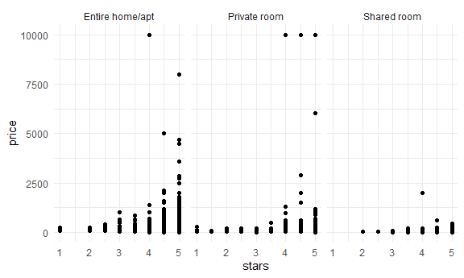
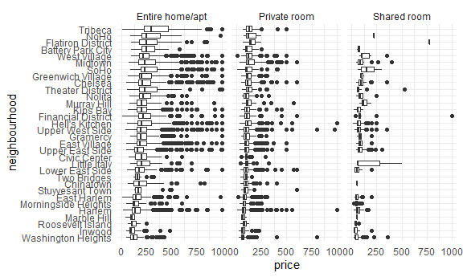
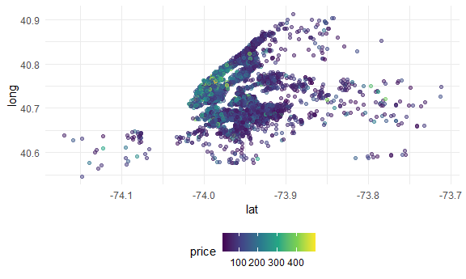

case\_study
================
Mengfan Luo
23/10/2021

## Load dataset

``` r
data("nyc_airbnb")
```

``` r
nyc_airbnb = 
  nyc_airbnb %>% 
  mutate(stars = review_scores_location / 2) %>% 
  rename(borough = neighbourhood_group)
```

# Let’s count

``` r
nyc_airbnb %>% 
  janitor::tabyl(borough,room_type)
```

    ##        borough Entire home/apt Private room Shared room
    ##          Bronx             192          429          28
    ##       Brooklyn            7427         9000         383
    ##      Manhattan           10814         7812         586
    ##         Queens            1388         2241         192
    ##  Staten Island             116          144           1

``` r
nyc_airbnb %>% 
  count(borough,room_type) %>% 
  pivot_wider(
    names_from = room_type,
    values_from = n
  )
```

    ## # A tibble: 5 x 4
    ##   borough       `Entire home/apt` `Private room` `Shared room`
    ##   <chr>                     <int>          <int>         <int>
    ## 1 Bronx                       192            429            28
    ## 2 Brooklyn                   7427           9000           383
    ## 3 Manhattan                 10814           7812           586
    ## 4 Queens                     1388           2241           192
    ## 5 Staten Island               116            144             1

-   How many rentals are there? Of what type? In what places?

-   Is price correlated with review scores?

-   Which neighborhood is most popular?

-   Which neighborhood has the highest review?

-   Is availability related to peice?

-   Is room type related to neighborhood?

-   Is length of state related to neighborhood group?

## My question: IS minimum\_nights related to room\_type?

    nyc_airbnb %>% 
      ggplot(aes(x = minimum_nights))+
      geom_histogram()
      ggplot(aes(x = minimum_nights,y = price,color = room_type))+
      geom_point(size = 5, alpha = .6)

Price and room type

``` r
nyc_airbnb %>% 
  ggplot(aes(x = stars, y = price))+
  geom_point()+
  facet_grid(.~room_type)
```

    ## Warning: Removed 10037 rows containing missing values (geom_point).



Price and neighbourhood?

``` r
nyc_airbnb %>% 
  filter(borough == "Manhattan") %>% 
  group_by(neighbourhood) %>% 
  summarize(mean_price = mean(price,na.rm = TRUE)) %>% 
  arrange(mean_price)
```

    ## # A tibble: 32 x 2
    ##    neighbourhood       mean_price
    ##    <chr>                    <dbl>
    ##  1 Marble Hill               83.6
    ##  2 Inwood                    86.5
    ##  3 Washington Heights        90.1
    ##  4 Morningside Heights      107. 
    ##  5 Harlem                   117. 
    ##  6 Roosevelt Island         122. 
    ##  7 Two Bridges              123. 
    ##  8 East Harlem              128. 
    ##  9 Chinatown                158. 
    ## 10 Upper East Side          172. 
    ## # ... with 22 more rows

``` r
nyc_airbnb %>% 
  filter(borough == "Manhattan",
         price <= 1000) %>% 
  mutate(neighbourhood = fct_reorder(neighbourhood,price)) %>% 
  ggplot(aes(x = neighbourhood, y = price))+
  geom_boxplot()+
  coord_flip()+
  facet_grid(.~room_type)
```



Price vs location

``` r
nyc_airbnb %>% 
  filter(price < 500) %>% 
  sample_n(5000) %>% ##deal with large datasets
  ggplot(aes(x = lat, y = long,color = price))+
           geom_point(alpha = .5)
```



## retry leaflet

``` r
nyc_airbnb %>% 
  
  leaflet() %>% 
  addTiles() %>% 
  addMarkers(~lat,~long)
```
